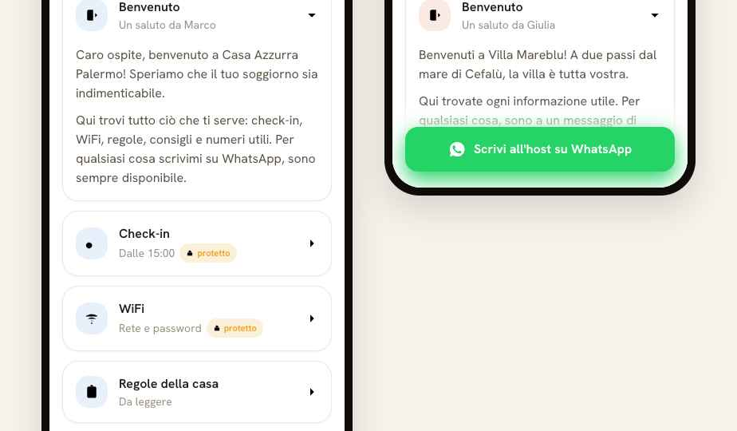
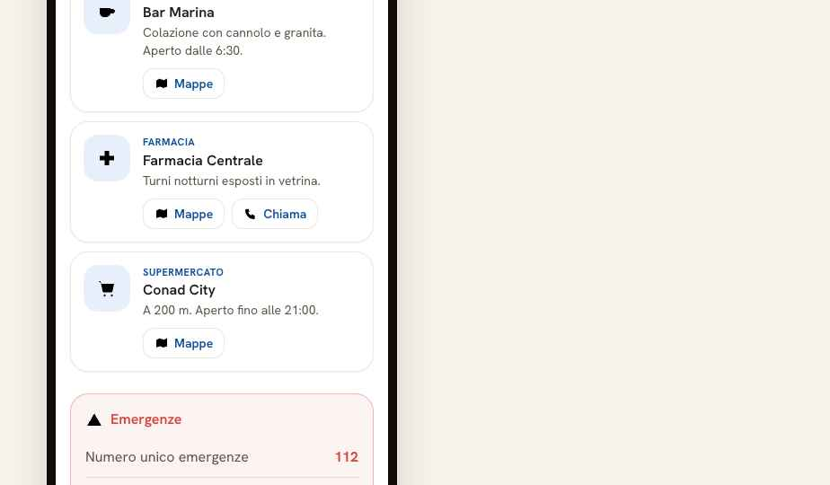
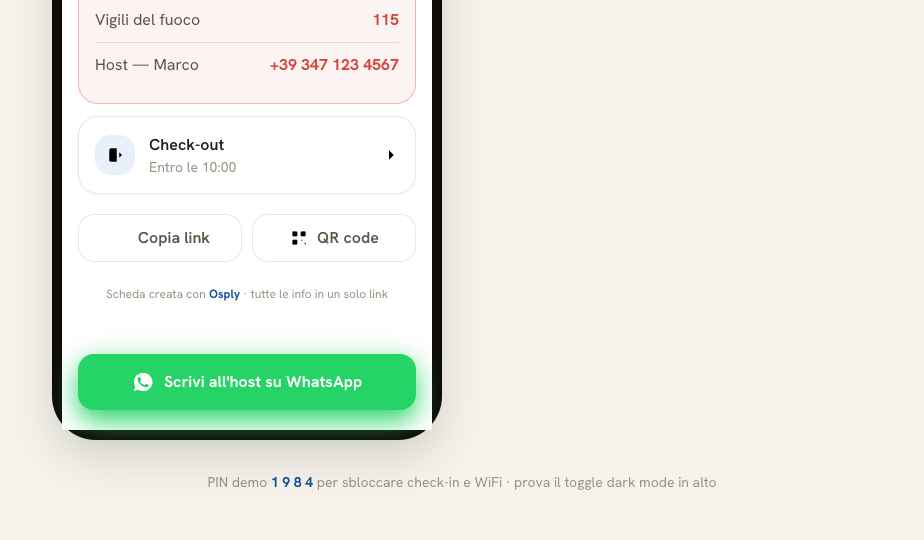

*[Versione italiana](README.md)*

# Osply — technical case study

**A digital guest guide for small hospitality businesses.** A host builds the guide for their
property — check-in, WiFi, house rules, emergencies, check-out, local recommendations — and
shares it with guests through a single link, a QR code, or WhatsApp.

🔗 **Live:** [osply.app](https://osply.app) · **Demo guide:** [osply.app/g/casa-azzurra-palermo](https://osply.app/g/casa-azzurra-palermo)

> Open it on your phone. The guest page is the product, and it was designed mobile-first.

---

> **What this repository is.** It is not the Osply source code. It is a technical write-up of
> how I designed and built it, with excerpts of the real code as evidence. The full codebase
> is private — see [License](#license). If you are evaluating my profile and want to see the
> source, just ask: I am happy to walk through it on a screen share, or give you read access
> to the private repository.

---

## At a glance

Laravel 13, PHP 8.3, Livewire 4, Tailwind 4, MySQL. Designed, written, tested and deployed
solo, from an empty domain to production.

| | |
|---|---|
| **Code commits** | 117 — 63 `feat`, 27 `test`, 15 `fix`, 6 `chore`, 1 `refactor`, 5 UI restyle |
| **Tests** | 250 (Pest) — 246 passing, 4 skipped, 0 failing |
| **Application PHP classes** | 36 |
| **Blade views** | 77 |
| **Timeline** | June → September 2026, two milestones (v1.0, v1.1) |
| **Status** | running in production on a VPS, own domain, HTTPS |

The private repository holds another 145 `docs` commits — planning artifacts: requirements,
phase plans, verification notes. I leave them out of the count because they are not code, but
they are the reason the code commits are small and tidy.

---

## The product, in three screens

| Guest guide | Protected content | Emergencies, check-out, WhatsApp |
|---|---|---|
|  |  |  |

Guests have no account, no login, and leave no data behind. They open a link and read.
Sensitive content — door codes, WiFi passwords — sits behind a PIN that the host shares
through a separate channel.

The WhatsApp button is the only direct contact route, and it opens the chat with a message
already written that identifies the property, so the host knows immediately who is writing
and from where.

---

## Architecture on one page

```
                    ┌──────────────────────────────┐
   guest   ──────►  │  /g/{slug}   guest guide     │  public, no auth, mobile-first
   (anonymous)      │  /s/{slug}   listing page    │  public, SEO, enquiry form
                    └──────────────┬───────────────┘
                                   │  GuideView (ip_hash) · LeadRequest
                                   ▼
                    ┌──────────────────────────────┐
   host    ──────►  │  /dashboard  private area    │  Fortify + Policies
   (auth)           │  properties · sections ·     │
                    │  tips · photos · inbox       │
                    └──────────────────────────────┘
```

Full-stack Laravel, no SPA. The dashboard runs on Livewire 4. The public page is plain Blade
with a small amount of vanilla JavaScript — **it loads neither Livewire nor Alpine**, because
it is the page that has to open fast on the mobile connection of a guest who has just arrived.

Details: **[docs/architettura.md](docs/architettura.md)** ·
Decisions and trade-offs: **[docs/decisioni-tecniche.md](docs/decisioni-tecniche.md)**
*(both in Italian)*

---

## Four things worth a look

### 1. A bug that only existed in production, and why the test suite could not see it

`/sitemap.xml` was returning a 500. Not always: **only after the first hit**. The first request
worked, every request for the next hour did not.

The cause was `Cache::remember` around an Eloquent Collection. Production runs
`CACHE_STORE=database`, which round-trips the cached value through `serialize()` and
`unserialize()`. On a cache miss the closure returns the real Collection, so you get a 200 and
the defect stays hidden. On every subsequent hit the value comes back degraded into plain
strings, and the view dies with `Attempt to read property slug on string`.

The interesting part is **why 250 tests had not caught it**: `phpunit.xml` forces
`CACHE_STORE=array`, which never serializes anything. The suite was structurally blind to this
whole class of bug.

The fix itself is trivial — cache primitives, not models. What I added afterwards matters more:

```php
/**
 * The cached value MUST be a plain array of primitives (not an Eloquent Collection
 * or Property models). Production's CACHE_STORE=database round-trips the value
 * through PHP serialize()/unserialize(); Eloquent models do not reliably survive
 * that round-trip on read, degrading into plain strings or incomplete objects and
 * causing a 500 on every warm-cache request.
 *
 * The cache key is versioned ('sitemap_v2'). The payload shape changed [...] Bumping
 * the key retires it instantly instead of requiring a cache flush at deploy time
 * (production has no PHP CLI, so `cache:clear` is not available over SSH).
 * Any future change to the shape of this payload must bump the key again.
 */
public function index(): Response
{
    $properties = Cache::remember('sitemap_v2', 3600, fn () =>
        Property::where('vetrina_enabled', true)
            ->select(['slug', 'updated_at'])
            ->get()
            ->map(fn (Property $property) => [
                'slug'       => $property->slug,
                'updated_at' => $property->updated_at->toAtomString(),
            ])
            ->all()
    );

    return response()->view('sitemap', compact('properties'))
        ->header('Content-Type', 'application/xml');
}
```

Versioning the cache key is not tidiness. The hosting plan does not expose the PHP CLI over
SSH, so running `cache:clear` on deploy is not an option. Bumping the key retires the stale
entry on the first request instead and lets the old one die on its own TTL.

I also added a regression test that forces the `database` driver, so the suite stops being
blind to it:

```php
// tests/Feature/SitemapDatabaseCacheTest.php — both a cold and a warm hit must return 200
```

### 2. Privacy enforced in the schema, not in a policy document

Guests are anonymous by construction. There is no `guests` table, no guest login, no tracking
cookie. What remains is cut to the minimum at migration level:

```php
// guide_views — guide analytics
$table->string('event_type', 20);       // view | whatsapp_click | maps_click | pin_unlock
$table->string('ip_hash', 64)->nullable();   // hashed, never the raw IP
$table->string('user_agent')->nullable();

// lead_requests — enquiries from the public listing page
$table->timestamp('consent_given_at')->nullable();  // explicit consent, timestamped
$table->string('ip_hash', 64)->nullable();
```

Retention is a command, not a promise:

```php
protected $signature = 'osply:prune-leads {--days=90 : Retention window in days}';

// Deletes LeadRequests in terminal states (Lost / Archived) older than the retention
// window. Leads in active states (New, Negotiating, Confirmed) are never touched.
```

### 3. The PIN, rate-limited per IP *and* per property

Sensitive sections sit behind a per-property PIN, hashed, unlocked for the browser session.
The rate limiter is keyed on IP **and** slug, so someone brute-forcing one property does not
lock out legitimate guests of the others:

```php
// Rate limiting: IP + slug key, max 5 attempts in a 10-minute window
$key = 'pin-unlock:' . sha1($request->ip() . '|' . $property->slug);

if (RateLimiter::tooManyAttempts($key, 5)) {
    $minutes = (int) ceil(RateLimiter::availableIn($key) / 60);
    return back()->withErrors([
        'pin' => "Troppi tentativi. Riprova tra {$minutes} {$label}.",
    ]);
}

if (! Hash::check($request->input('pin'), $property->guest_pin_hash)) {
    RateLimiter::hit($key, 600);
    return back()->withErrors(['pin' => 'PIN errato. Riprova.']);
}

RateLimiter::clear($key);
$request->session()->put('guide_unlocked_' . $property->id, true);
```

On the host side, authorization is a Laravel Policy with an admin bypass in `before()`. The
tests cover the BOLA case explicitly: an owner trying to open someone else's property gets a
403 at the Livewire component's `mount()`, before any data is read.

### 4. A small, pure, tested value object

Normalising an Italian phone number for a `wa.me/` link looks like a one-liner. It is not:
`+39`, `0039`, `339 123 4567`, `0912345678`, spaces, dots, dashes. And above all you have to
decide what happens when the number **cannot** be normalised.

```php
/**
 * Normalize a phone string to E.164 digits (no leading +) for wa.me/ links.
 *
 * Rules, applied in order:
 *   1. null / blank → null.
 *   2. International prefix recognised BEFORE stripping: if the string starts
 *      with '+' or '00', drop the prefix, strip non-digits, and use the digits
 *      as-is when >= 8 remain (no extra '39'); otherwise null.
 *   3. Otherwise strip non-digits: if the result starts with '3' and is 9–10
 *      digits long → prepend '39' (Italian mobile).
 *   4. Any other case (too short, not starting with 3, landline without prefix)
 *      → null (caller falls back to a "copy number" button).
 */
public static function toE164(?string $raw): ?string
```

Final class, static, no dependencies, with its own unit test. Rule 4 is the product decision:
when a number is ambiguous the code does not guess a prefix, it degrades to a "copy number"
button, which is always correct.

---

## How it is tested

250 Pest tests, mostly feature tests against observable behaviour.

| Area | What it checks |
|---|---|
| Authorization | an owner sees and edits only their own properties; BOLA on preview, sections, tips, inbox |
| Public guide | only active content is rendered; protected sections leak nothing without the PIN |
| PIN | correct PIN unlocks, wrong one does not, rate limit after 5 attempts |
| Lead privacy | consent recorded, IP hashed, retention of terminal states |
| Integrations | WhatsApp link built correctly, QR points at the right URL |
| Regressions | the sitemap case above, with the cache driver forced |

Automated quality gates: **Pint** for code style and **Larastan** for static analysis, running
on two GitHub Actions workflows on every push and pull request.

---

## What I deliberately left out

v1 is not a PMS. No booking engine, no payments, no multi-language, no chatbot. Every proposed
feature had to answer one question: *does this help a property create and share a clearer guest
guide?* If the answer was no, it went to the backlog.

That is the part of this project I am most pleased with. v1 was declared finished and closed
against an acceptance checklist written **before** starting, with no "while I'm at it"
additions. v1.1 — the public listing page and enquiry capture — came afterwards as a separate
milestone, planned and closed the same way.

---

## What I would do differently

- **The sitemap bug taught me something structural.** When the test environment diverges from
  production on a driver — cache, sessions, queue, filesystem — that divergence is a blind
  spot, not a configuration detail. I would now run at least one smoke test in CI against the
  production drivers.
- **Images** go through Intervention, but I am not yet serving a modern format automatically.
  On a mobile-first page that is the next optimisation that actually moves the needle.
- **The retention command exists but is not scheduled yet.** The logic is written and tested;
  the cron entry in production is not there. I would rather say it here than have you find it
  in an interview.

---

## License

Proprietary material, published **for evaluation only**. Readable and quotable; not reusable,
not redistributable, not deployable. See [LICENSE](LICENSE).

The code excerpts are illustrative fragments of a larger private codebase. They are here to be
read, not reused.
