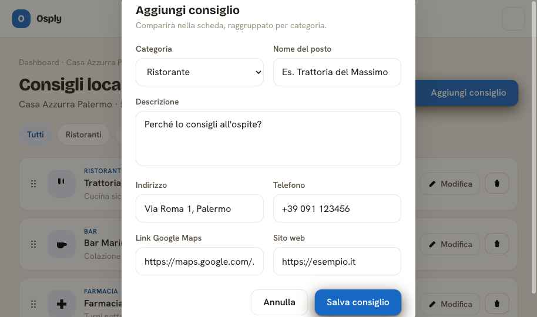
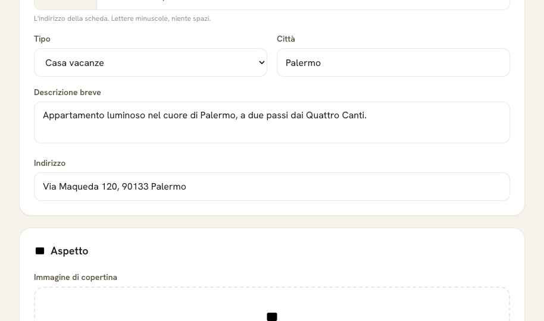

# Architettura

Torna al [case study](../README.md).

---

## Il principio che regge tutto

Osply ha due tipi di utente con esigenze opposte:

- **L'ospite** apre un link una volta sola, da mobile, spesso su rete cellulare, spesso mentre
  è fermo davanti a un portone. Deve leggere subito.
- **L'host** lavora sulla propria scheda da desktop, con calma, e ha bisogno di form ricchi e
  reattivi.

Da qui la scelta strutturale: **la pagina pubblica e la dashboard non condividono lo stack
frontend.** La dashboard è Livewire 4. La pagina pubblica è Blade puro con JavaScript vanilla —
non carica Livewire, non carica Alpine.

Non è una micro-ottimizzazione: è la ragione per cui `/g/{slug}` risponde in ~0,3s con un
payload minimo, mentre la dashboard può permettersi il peso di un framework reattivo.

La conseguenza operativa è che l'interattività della pagina pubblica (accordion, chip di
accesso rapido, tracking dei click) è scritta a mano in un file JS, con un fallback `<noscript>`
per i contenuti essenziali.

Il lato host è l'opposto: form ricchi, modali, riordino drag-and-drop, validazione reattiva —
tutto quello per cui Livewire è la scelta giusta.

| Dashboard host — consigli locali | Form pubblico richiesta info |
|---|---|
|  |  |

La dashboard resta volutamente sobria. L'80% della cura estetica è andato sulla pagina ospite,
perché è quella che vede il cliente del cliente.

---

## Stack

| Livello | Scelta |
|---|---|
| Framework | Laravel 13 |
| Runtime | PHP 8.3 |
| Database | MySQL 8 |
| Dashboard | Livewire 4 + Flux UI |
| Stile | Tailwind CSS 4, configurazione CSS-first |
| Auth | Laravel Fortify (via starter kit ufficiale Livewire) |
| Autorizzazione | Policy Laravel + campo `role` su `users` |
| Storage | disco `public` Laravel, symlink |
| Immagini | Intervention Image |
| QR code | `tarikmanoar/laravel-qrcode` (SVG + PNG) |
| Test | Pest 4 |
| Qualità | Pint, Larastan, GitHub Actions |

Nessun pacchetto di permessi, nessun admin panel, nessuna SPA. Due ruoli (`admin`, `owner`)
sono una colonna stringa e un `before()` nella Policy — un pacchetto qui sarebbe stato peso
senza beneficio.

---

## Modello dati

```
User ──< Property ──< GuideSection
                  ├──< LocalRecommendation
                  ├──< PropertyPhoto
                  ├──< GuideView          (analytics, ip_hash)
                  └──< LeadRequest        (richieste info dalla vetrina)
```

### `properties` — il cuore

Una struttura porta con sé identità, contatti, branding e stato di pubblicazione:

```php
$table->foreignId('user_id')->constrained()->cascadeOnDelete();
$table->string('slug')->unique();              // la URL pubblica
$table->string('brand_color', 7)->nullable();  // accento per-struttura
$table->string('host_whatsapp')->nullable();
$table->boolean('whatsapp_enabled')->default(false);
$table->string('guest_pin_hash')->nullable();  // hashato, mai in chiaro
$table->boolean('protected_content_enabled')->default(false);
$table->string('status', 20)->default('draft'); // draft | published | disabled
$table->timestamp('published_at')->nullable();
```

Il `brand_color` è un dettaglio con una conseguenza tecnica: passa da un accessor
`getSafeBrandColorAttribute()` che valida il valore prima di iniettarlo in una CSS custom
property. Un colore arbitrario finito in un attributo `style` è una superficie di injection,
quindi non arriva mai grezzo alla view.

Il tema per-struttura si regge su tre variabili derivate a runtime:

```php
$accentVars = "--brand: {$property->safe_brand_color};"
    ." --brand-d: color-mix(in srgb, var(--brand) 82%, #000);"
    ." --brand-l: color-mix(in srgb, var(--brand) 12%, #fff);";
```

e la classe `.guest` mappa quel trio sui token semantici usati dalle partial, così la stessa
scheda si rende identica nella pagina pubblica e nell'anteprima dell'host.

### `guide_sections` — contenuto misto

Le sezioni hanno sia `content` (testo libero) sia `content_json` (strutturato). WiFi, check-in,
check-out ed emergenze usano il secondo: sono dati con una forma, non paragrafi, e vanno resi
con partial dedicate (`section-content-wifi`, `section-content-checkin`, …).

Ogni sezione ha `sort_order`, `is_active` e `is_protected`: attivabile, riordinabile e
proteggibile in modo indipendente.

### `guide_views` — analytics che non profila

```php
$table->string('event_type', 20);           // view | whatsapp_click | maps_click | pin_unlock
$table->string('ip_hash', 64)->nullable();  // hash, mai l'IP in chiaro
```

Nessun identificatore persistente dell'ospite. L'host vede quante visite, quanti click
WhatsApp e la data dell'ultima visita — abbastanza per sapere se la scheda serve, troppo poco
per riconoscere una persona.

---

## Rotte

### Pubbliche — nessuna autenticazione

```
GET   /g/{slug}                  scheda ospite
POST  /g/{slug}/unlock           verifica PIN          (rate limit: 5 / 10 min per IP+slug)
POST  /g/{slug}/track            evento analytics      (rate limit)

GET   /s/{slug}                  vetrina pubblica (SEO)
POST  /s/{slug}/richiesta        richiesta info        (consenso obbligatorio)
POST  /s/{slug}/track            evento analytics

GET   /sitemap.xml               cache 1h, chiave versionata
GET   /robots.txt
GET   /privacy
```

Il model binding è su slug (`{property:slug}`), non su id: le URL pubbliche non espongono
progressivi numerici.

### Area host — `auth` + `verified`

```
GET     /dashboard
GET     /properties                          lista
GET     /properties/create · {id}/edit       form
GET     /properties/{id}/preview             anteprima della vista ospite
GET     /properties/{id}/sections            editor sezioni
GET     /properties/{id}/recommendations     consigli locali
GET     /properties/{id}/photos              galleria (throttle:30,1 anti-flood upload)
GET     /properties/{id}/qr/download         QR scheda
GET     /properties/{id}/qr/vetrina/download QR vetrina
GET     /leads                               inbox richieste
DELETE  /leads/{lead}
```

Le rotte Livewire usano `Route::livewire()`, la forma introdotta da Livewire 4.

---

## Autorizzazione

Policy Laravel, auto-discovery per convenzione, con bypass admin nel gancio `before()`:

```php
public function before(User $user, string $ability): bool|null
{
    if ($user->role === 'admin') {
        return true;
    }

    return null;   // gli owner cadono nei check per-metodo
}

public function view(User $user, Property $property): bool
{
    return $user->id === $property->user_id;
}
```

Il punto che conta è **dove** viene chiamata: nel `mount()` dei componenti Livewire, prima di
caricare qualunque dato. Un owner che tenta di aprire la struttura di un altro prende 403
all'ingresso, non dopo che i dati sono già stati letti dal database. La suite copre questo caso
esplicitamente per anteprima, sezioni, consigli e inbox.

---

## Performance

- **Eager loading** delle sezioni e dei consigli sulla scheda pubblica: la pagina è un
  `Property` con le sue relazioni, non N+1 query per sezione.
- **Query selettive** dove serve solo una proiezione — la sitemap legge `select(['slug',
  'updated_at'])`, non i modelli interi.
- **Cache** della sitemap con TTL di un'ora e chiave versionata (vedi il caso raccontato nel
  [README](../README.md#1-un-bug-che-esisteva-solo-in-produzione-e-perché-la-suite-non-poteva-vederlo)).
- **Nessun framework JS** sulla pagina pubblica.
- **Icone come sprite SVG inline**, non come richieste separate.

---

## Deploy

VPS con pannello, ambiente chroot, layout separato tra la root applicativa e la document root
pubblica. Il deploy è git-based con build degli asset e `storage:link`.

Il vincolo che ha più influenzato il codice: **la CLI PHP non è disponibile via SSH** in
quell'ambiente. Niente `php artisan cache:clear` al deploy. Da qui la scelta di versionare la
chiave di cache quando cambia la forma del payload, invece di affidarsi a uno svuotamento
manuale che non si può eseguire.

È il genere di vincolo che non si trova nella documentazione del framework e che decide come
scrivi il codice.
